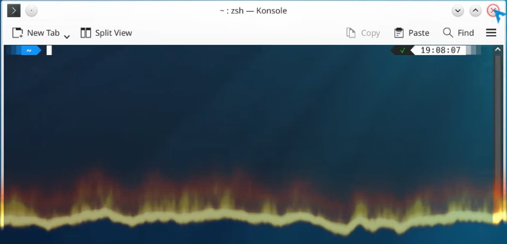

# Burning Windows

**Burning Windows** is a bottom-to-top burning close animation for KDE Plasma 6 KWin.



## Features

- Bottom-to-top burn on normal application-window close
- Transparent consumed area with flame, glow, and ash dissolve
- Normal decorated and fullscreen application windows
- Popups, menus, dialogs, panels, Plasma internals, and special windows are skipped
- Standard Animations-page entry and exclusive close-animation category
- Opacity fallback when KWin cannot create the custom shader
- Plasma 6 Wayland focus

## Requirements

- KDE Plasma 6 / KWin 6 or later
- An OpenGL-capable KWin compositor for the full shader effect

## AUR installation

```bash
 yay -S burning-windows
```

Enable the effect at:

```text
System Settings -> search for "Animations" -> Window Open/Close Animation -> Burning Windows
```

### Upgrading from 0.1.0

Upgrade normally through the AUR. Reboot once after this migration so the running KWin process unloads the old native `remisa_burn` module. This is a one-time migration step, not something required after later KWin updates.

The old 0.1.0 `uninstall.sh` removed files directly. If 0.1.0 had originally been installed through AUR/pacman, running that script did **not** remove the package record. In that state, either upgrade normally with `yay -S burning-windows`, or remove the stale registered package with `sudo pacman -R burning-windows` before using the per-user `./install.sh`.

The package deliberately has no pacman install script that edits a user's home directory. Legacy `burning_windowsEnabled` settings are disabled during manual migration. New users select `Burning Windows` on the System Settings **Animations** page. Since Plasma 6.4, window open/close animations are intentionally hidden from the older Desktop Effects page.

## Manual per-user installation

Do not mix this with the AUR package.

```bash
./install.sh
```

The effect is installed under:

```text
~/.local/share/kwin/effects/kwin4_effect_burning_windows
```

Remove a manual installation with:

```bash
./uninstall.sh
```

## Distribution packaging

The project has no build products. A system package only needs to copy `package/` to:

```text
/usr/share/kwin/effects/kwin4_effect_burning_windows
```

A minimal CMake install is also available:

```bash
cmake -S . -B build -DCMAKE_INSTALL_PREFIX=/usr
DESTDIR="$pkgdir" cmake --install build
```

## Validation

```bash
./tests/validate.sh
```

The validation script checks metadata, shell syntax, JavaScript syntax when Node.js is available, version consistency, and the CMake install tree.

## Troubleshooting

First open the correct settings module (Plasma 6.4 or later):

```bash
kcmshell6 kcm_animations
```

Window open/close effects no longer appear on the Desktop Effects page.

Check whether KWin can see and load the effect:

```bash
qdbus6 org.kde.KWin /Effects org.kde.kwin.Effects.listOfEffects | grep kwin4_effect_burning_windows
qdbus6 org.kde.KWin /Effects org.kde.kwin.Effects.isEffectSupported kwin4_effect_burning_windows
qdbus6 org.kde.KWin /Effects org.kde.kwin.Effects.isEffectLoaded kwin4_effect_burning_windows
```

Inspect the current-session log:

```bash
journalctl --user -b | grep -i 'Burning Windows\|kwin4_effect_burning_windows'
```

Installed package layout:

```text
package/
├── metadata.json
└── contents/
    ├── code/main.js
    └── shaders/
        ├── burn.frag
        └── burn_core.frag
```

## License

MIT License.
